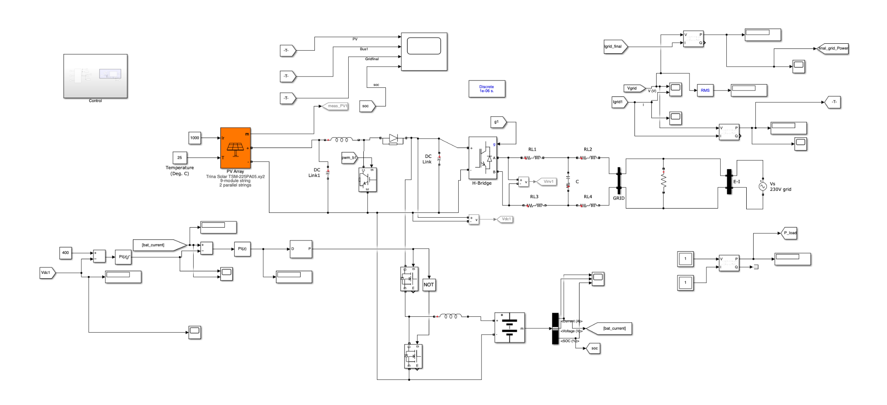
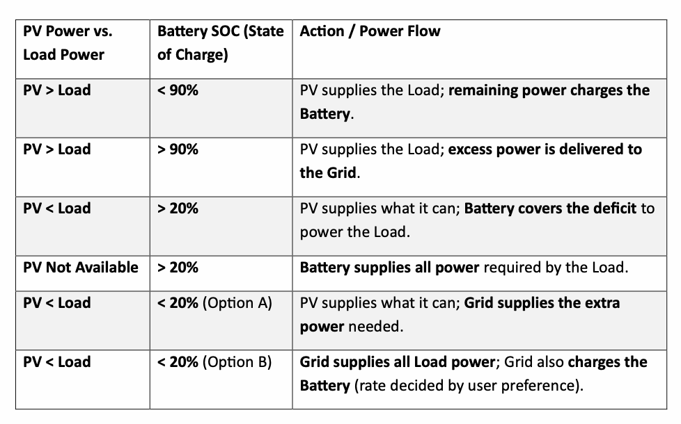

# Residential PV-BESS Energy Management in MATLAB/Simulink

**First-Class BEng Electrical & Electronic Engineering final-year project** modelling a grid-connected residential photovoltaic (PV) system with battery energy storage (BESS), maximum power point tracking (MPPT), bidirectional battery control and rule-based energy management.

The project was developed in **MATLAB/Simulink R2023b** using **Simscape Electrical**. Its purpose is to coordinate energy flow between PV generation, a battery, the household load and the utility grid under changing generation and battery conditions.

## System overview



The model uses a common DC-link architecture:

**PV array -> boost DC-DC converter with P&O MPPT -> DC link -> single-phase H-bridge inverter -> LCL filter -> grid**

A **96 V, 50 Ah battery** is connected to the DC link through a **bidirectional DC-DC converter**, enabling controlled charging and discharging. The inverter controller includes grid synchronization, current regulation, reference-voltage generation and PWM switching control.

## Key simulation parameters

| Parameter | Value |
|---|---:|
| MATLAB / Simulink | R2023b |
| Grid voltage | 230 V |
| Rated system power | 4 kW |
| DC-link reference | 400 V |
| Battery nominal voltage | 96 V |
| Battery capacity | 50 Ah |
| Power-stage sample time | 1 us |
| Control sample time | 10 us |
| Simulation stop time | 0.8 s |

## Control strategy

### Perturb & Observe MPPT

PV voltage and current are measured and used to calculate instantaneous PV power. The P&O algorithm evaluates changes in voltage and power between samples and adjusts the PV operating reference to track the maximum power point. A PI regulator and PWM stage then control the boost converter.

A standalone copy of the implemented P&O logic is included in [`scripts/PandO.m`](scripts/PandO.m).

### Battery and DC-link control

The bidirectional converter regulates battery current while supporting the common DC link. The controller allows the battery to absorb surplus PV energy or discharge when PV generation is insufficient, subject to SOC limits.

### Rule-based energy management



The energy-management system evaluates PV power, load demand and battery SOC and selects the corresponding operating mode:

| Condition | Battery SOC | Action |
|---|---:|---|
| PV > Load | < 90% | PV supplies load; surplus charges battery |
| PV > Load | > 90% | PV supplies load; surplus is exported to grid |
| PV < Load | > 20% | Battery discharges to cover the deficit |
| PV unavailable | > 20% | Battery supplies the load |
| PV < Load | < 20% | Battery discharge is restricted; grid supports the load |

## Simulation results

The five simulated operating conditions show the controller responding to changes in PV generation and battery SOC while maintaining power delivery to the load.

### Condition 1 - surplus PV, battery charging

PV power settles near its operating point after startup and battery SOC trends upward.


### Condition 3 - reduced PV, battery discharging

With PV generation below the load, battery SOC decreases as stored energy supports the power deficit.


### Condition 5 - low SOC, grid support

At low battery SOC, the energy-management logic restricts further discharge and relies on grid support for the remaining demand.


All result plots for Conditions 1-5 are available in [`RESULTS.md`](RESULTS.md).

## Repository structure

```text
.
├── model/
│   └── BESSINDPROJ.slx
├── scripts/
│   ├── runitfirstly.m
│   └── PandO.m
├── results/
│   ├── condition_1/
│   ├── condition_2/
│   ├── condition_3/
│   ├── condition_4/
│   └── condition_5/
├── images/
│   ├── simulink_full_model.png
│   └── operating_conditions.png
├── docs/
│   └── Final_Project_Report.pdf
├── RESULTS.md
├── NOTICE.md
└── README.md
```

## Running the model

1. Open MATLAB/Simulink R2023b or a compatible release with Simscape Electrical installed.
2. Clone or download this repository and set the repository root as the working directory.
3. Initialise the base-workspace parameters:

```matlab
run('scripts/runitfirstly.m')
```

4. Open the Simulink model:

```matlab
open_system('model/BESSINDPROJ.slx')
```

5. Run the model and inspect the PV power, battery SOC, bus power and grid-power scopes.

The `PandO.m` file is included as a readable standalone copy of the P&O logic used in the project; the Simulink model contains the implemented control subsystem.

## Project scope

The work focuses on simulation-based system modelling, converter control, MPPT, SOC-based battery operation, grid interaction and energy-management validation. Hardware implementation, battery degradation/lifecycle modelling, advanced grid-stability studies and time-of-use tariff optimisation were outside the final project scope.

## Project report

A redacted copy of the final dissertation is included in [`docs/Final_Project_Report.pdf`](docs/Final_Project_Report.pdf). The university student ID has been removed from the public copy.

## Author

**Michel El Khalil**  
BEng (Hons) Electrical & Electronic Engineering  
University of Greenwich, 2026

## Usage

This repository is provided as an academic and engineering portfolio project. See [`NOTICE.md`](NOTICE.md) for usage information.
