# Simulation Results

Five operating conditions were used to validate the rule-based energy management strategy. The model was simulated for 0.8 s using a 1 us power-stage sample time and a 10 us control sample time.

## Condition 1 - PV generation greater than load: battery charging

When PV generation exceeds the load and battery SOC is below 90%, the PV supplies the load and the surplus charges the battery.

### PV power
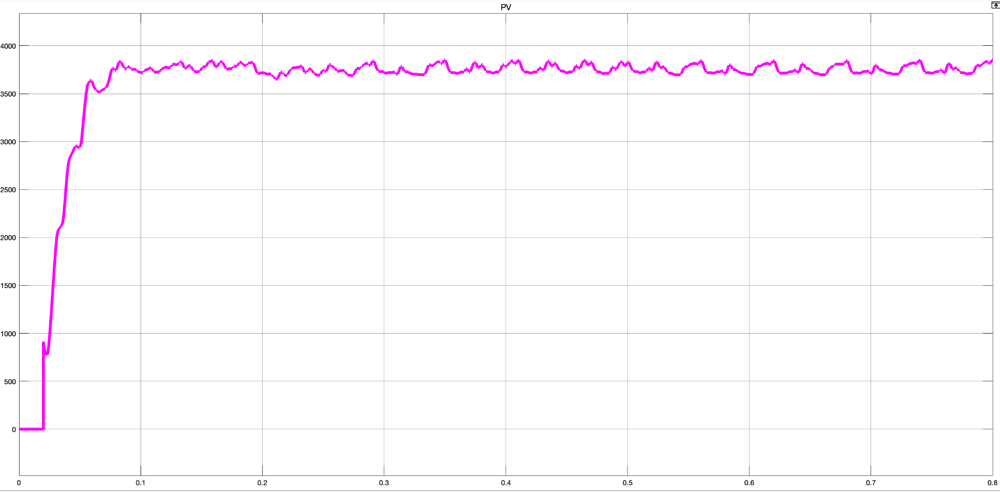

### Battery SOC
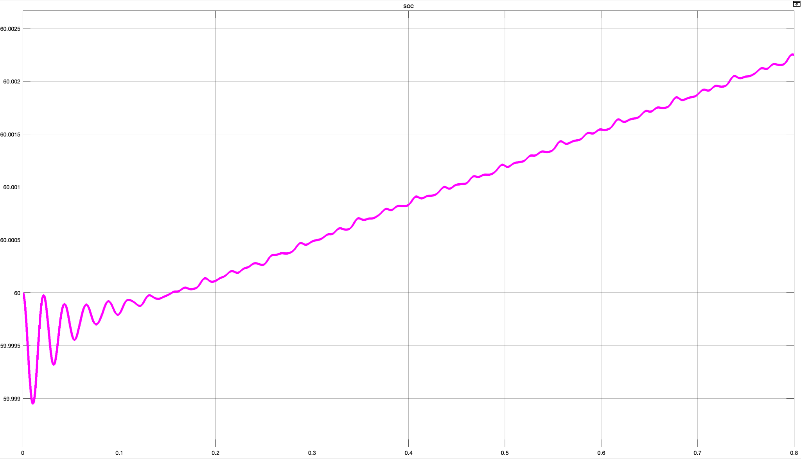

### Bus and grid power
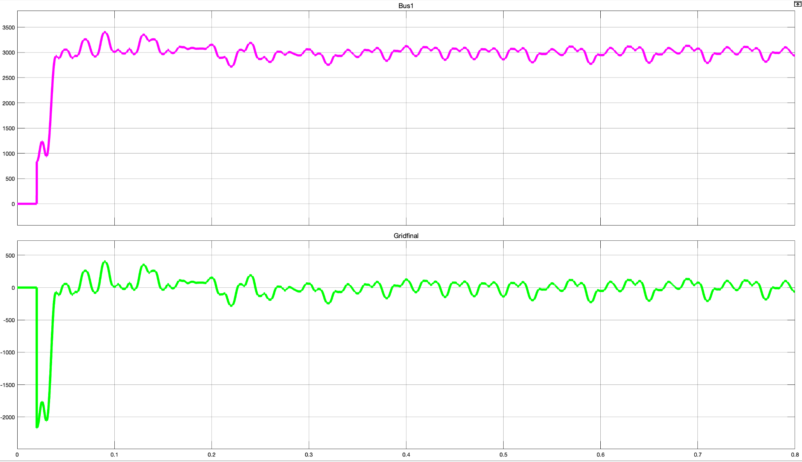

## Condition 2 - PV generation greater than load with high SOC: grid export

When PV generation exceeds the load and the battery is above the upper SOC threshold, surplus power is directed to the grid rather than continuing to charge the battery.

### PV power
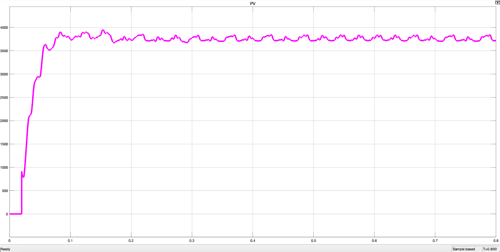

### Battery SOC
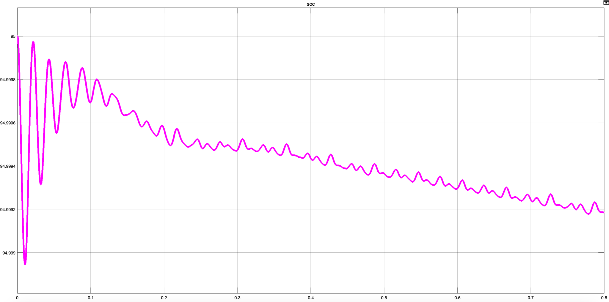

### Bus and grid power
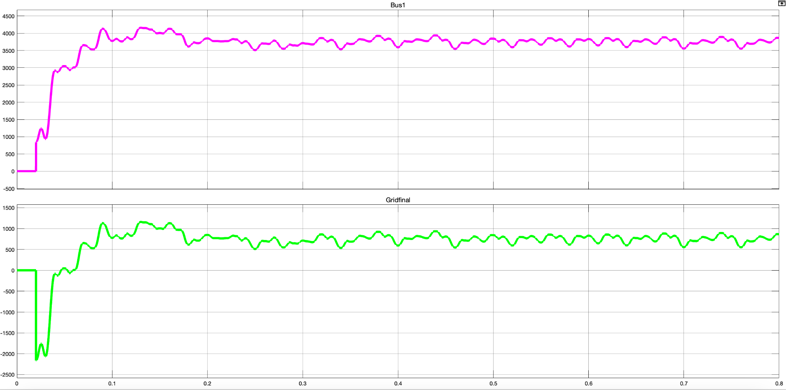

## Condition 3 - PV generation lower than load: battery discharging

When PV generation is below the load and SOC remains above 20%, the battery discharges to support the deficit.

### PV power
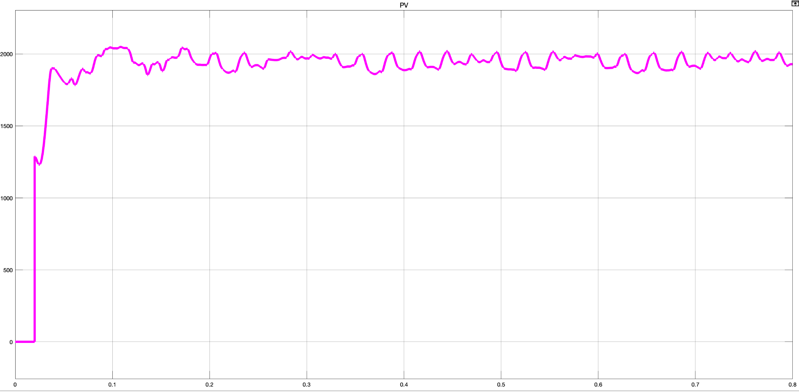

### Battery SOC
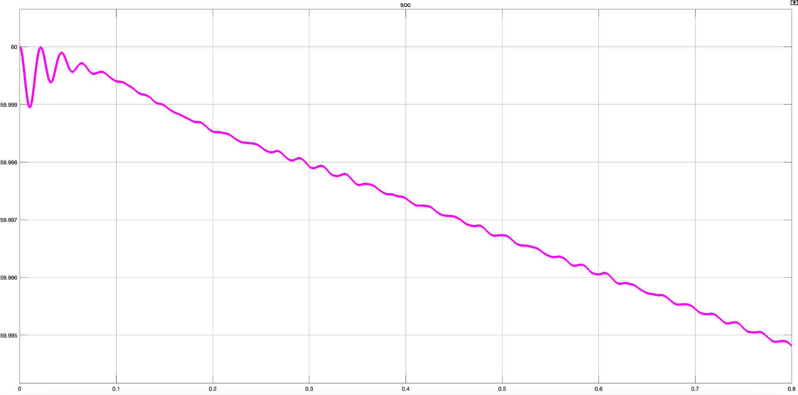

### Bus and grid power
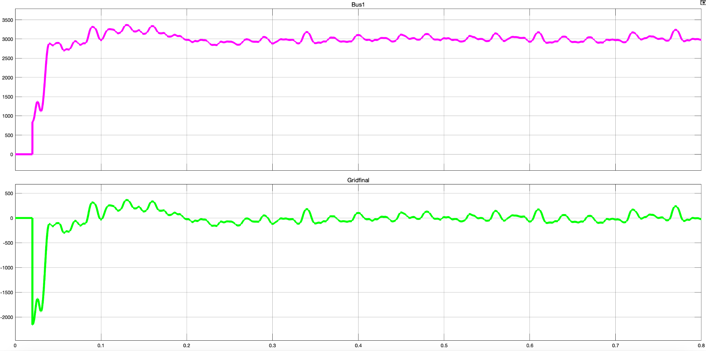

## Condition 4 - PV not available: battery-dominant operation

With no available PV generation and sufficient battery SOC, the battery supplies the load.

### PV power
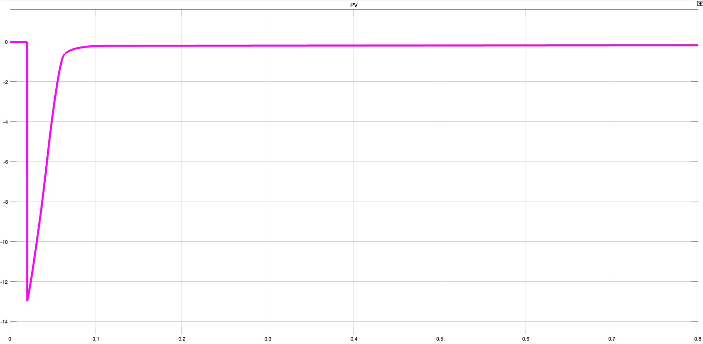

### Battery SOC
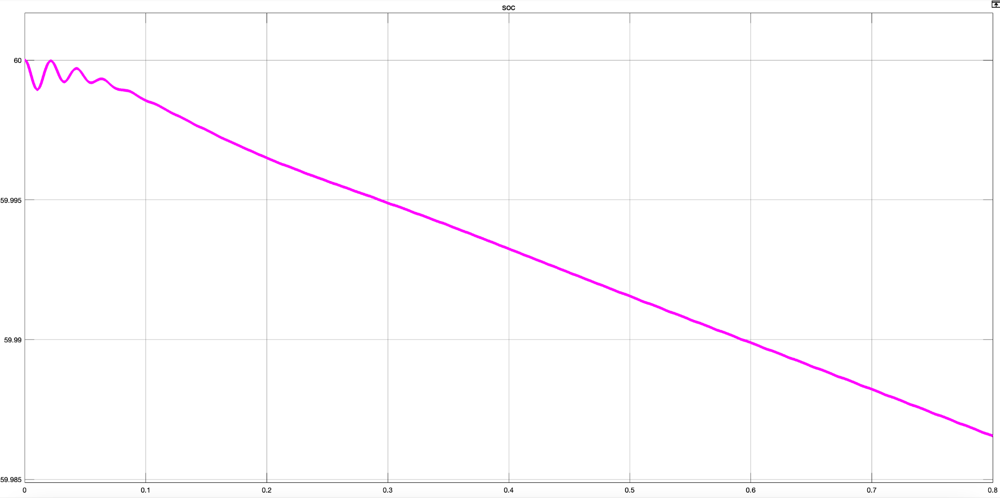

### Bus and grid power
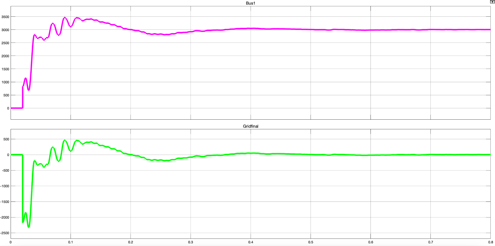

## Condition 5 - Low battery SOC: grid support

When PV generation is below the load and battery SOC is below 20%, further battery discharge is restricted and the grid supplies the required deficit.

### PV power
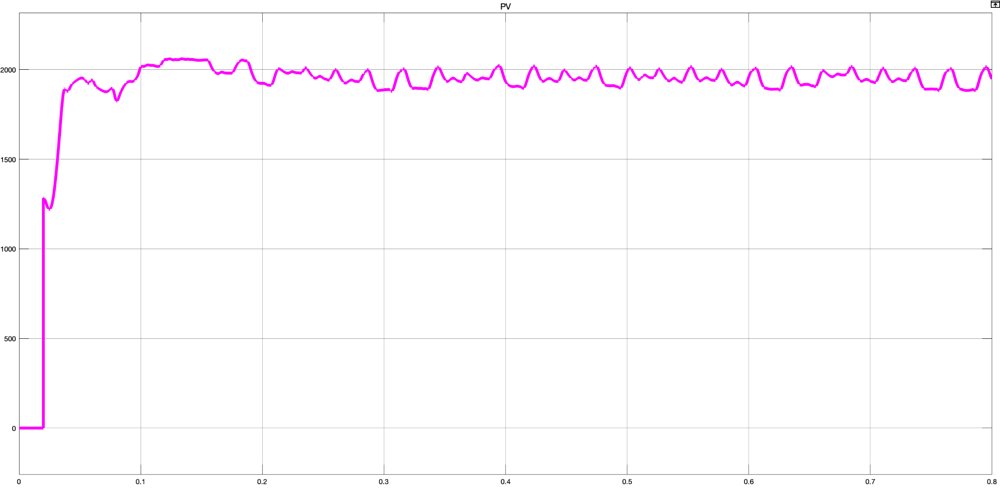

### Battery SOC
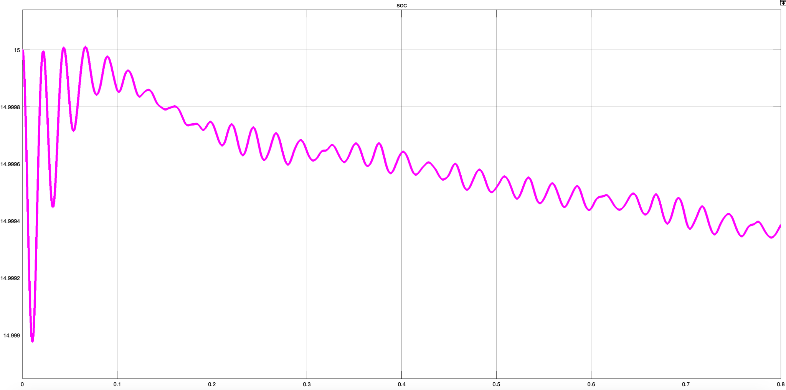

### Bus and grid power
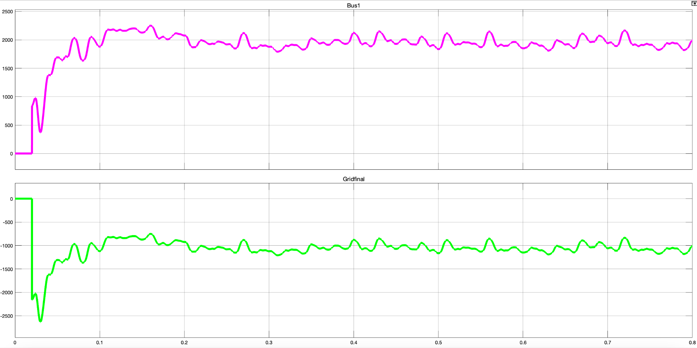

> Note: the plots include the short startup transient of the switching model before steady operation is established.
